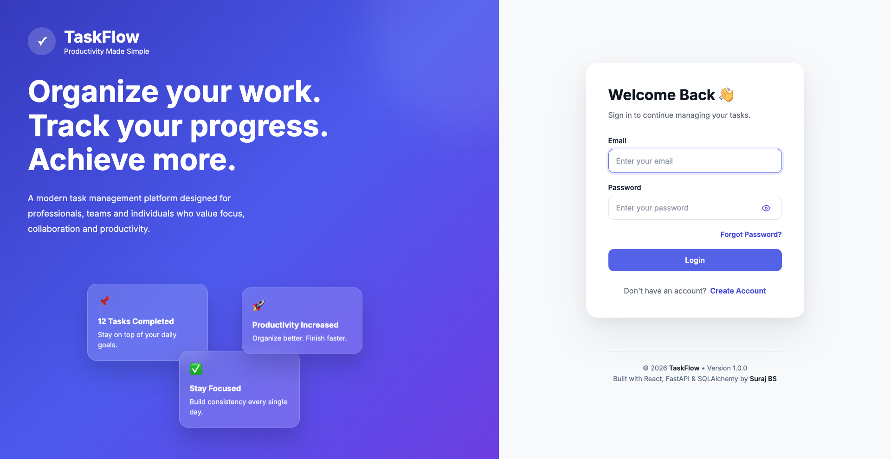
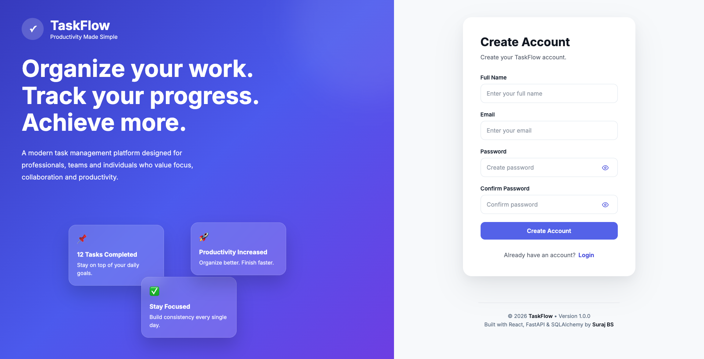
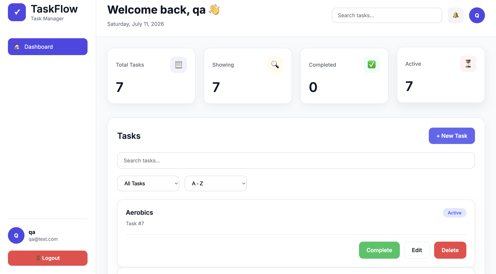
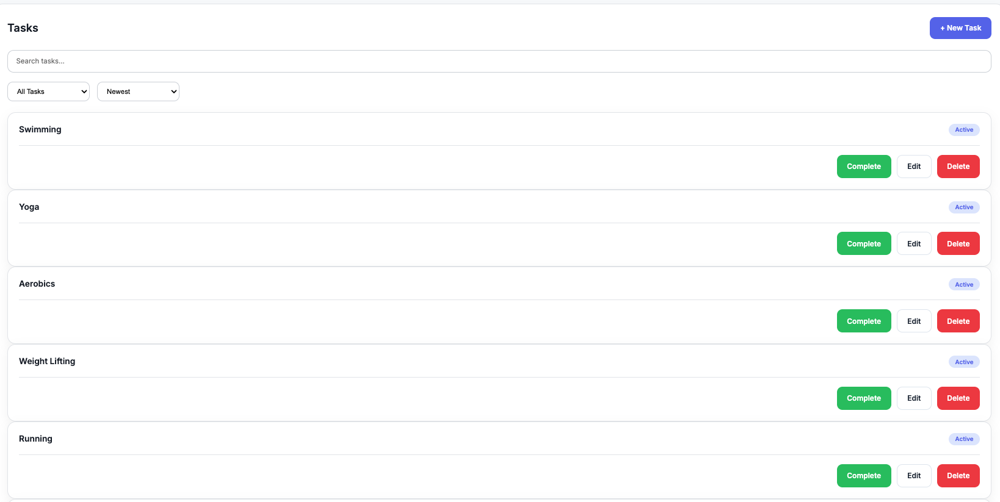

# 🚀 TaskFlow

> A modern full-stack task management application built with **React 19**, **FastAPI**, **SQLAlchemy**, and **SQLite**.

TaskFlow is a production-style task management platform that allows users to securely manage their personal tasks with JWT authentication, modern SaaS-inspired UI, responsive design, and a scalable feature-based architecture.

---

## ✨ Features

### 🔐 Authentication

- User Registration
- Secure Login
- JWT Authentication
- Protected Routes
- Session Persistence
- Logout

### ✅ Task Management

- Create Tasks
- Edit Tasks
- Delete Tasks
- Mark Tasks as Completed
- Mark Tasks as Active

### 📊 Dashboard

- Real-time Statistics
- Total Tasks
- Active Tasks
- Completed Tasks
- Search Results Counter

### 🔍 Productivity

- Search Tasks
- Filter Tasks
- Sort Tasks
- Responsive Task Cards

### 🎨 UI / UX

- Modern SaaS Design
- Responsive Layout
- Reusable Components
- Toast Notifications
- Loading States
- Empty States
- Form Validation
- Password Visibility Toggle

---

# 🏗 Architecture

```
task-manager
│
├── frontend
│   ├── src
│   │   ├── api
│   │   ├── assets
│   │   ├── components
│   │   ├── context
│   │   ├── features
│   │   ├── hooks
│   │   ├── layouts
│   │   ├── pages
│   │   ├── routes
│   │   └── styles
│
├── backend
│   ├── auth.py
│   ├── database.py
│   ├── main.py
│   ├── models
│   ├── schemas
│   └── requirements.txt
```

---

# 🛠 Tech Stack

## Frontend

- React 19
- Vite
- React Router
- Axios
- Context API
- Custom Hooks
- CSS3

## Backend

- FastAPI
- SQLAlchemy
- SQLite
- JWT Authentication
- Pydantic

## Tools

- Git
- GitHub
- VS Code

---

# 📸 Screenshots

## Login



---

## Signup



---

## Dashboard



---

## Task Management



---

# ⚙️ Installation

## Clone Repository

```bash
git clone https://github.com/<your-github-username>/task-manager.git

cd task-manager
```

---

## Backend

```bash
cd backend

python -m venv venv

source venv/bin/activate

pip install -r requirements.txt

uvicorn main:app --reload
```

Backend runs on

```
http://localhost:8000
```

---

## Frontend

```bash
cd frontend

npm install

npm run dev
```

Frontend runs on

```
http://localhost:5173
```

---

# 🔑 Environment Variables

## Frontend

```
VITE_API_BASE_URL=http://localhost:8000
```

---

## Backend

```
SECRET_KEY=your-secret-key

ALGORITHM=HS256

ACCESS_TOKEN_EXPIRE_MINUTES=60
```

---

# 📡 API Endpoints

## Authentication

| Method | Endpoint |
|---------|----------|
| POST | /signup |
| POST | /login |
| GET | /me |

---

## Tasks

| Method | Endpoint |
|---------|----------|
| GET | /tasks |
| POST | /tasks |
| PUT | /tasks/{id} |
| DELETE | /tasks/{id} |

---

# 🔒 Security

- Password Hashing
- JWT Authentication
- Protected APIs
- User-specific Data Isolation
- Secure Route Protection

---

# 🚀 Future Improvements

- PostgreSQL Support
- Docker
- Refresh Tokens
- User Profile
- File Attachments
- Categories & Labels
- Due Dates
- Email Notifications
- Team Collaboration
- Dark Mode
- Drag & Drop Task Board

---

# 📚 What I Learned

During this project I explored:

- React Architecture
- Context API
- Custom Hooks
- FastAPI
- SQLAlchemy ORM
- JWT Authentication
- REST API Design
- Responsive UI Design
- Authentication Flow
- CRUD Operations
- Frontend & Backend Integration
- Production Folder Structure

---

# 👨‍💻 Author

**Suraj.BS**

---
